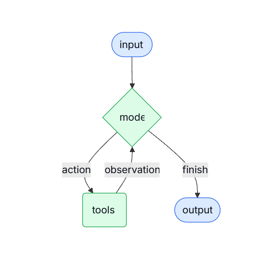

# Agent

> Agents combine language models with tools to create systems that can reason about tasks, decide which tools to use, and iteratively work towards solutions.
> 

> Agent 将语言模型与工具结合起来，构建出一种系统，这种系统能够对任务进行推理、决定使用哪些工具，并通过迭代的方式逐步逼近解决方案。
> 

在 Function Calling 章节中，我们了解了大模型如何调用工具，但在实际实现过程中仍会遇到以下问题：

1. 需要手动解析并处理模型返回的 `tool_calls`
2. 目前的 Function Calling 通常只演示单轮 Tool 调用。但在更复杂的任务场景中，模型的执行过程往往不是一次完成的，而可能表现为*LLM → tool → LLM → tool → LLM → ... → answer* 的多轮交互流程。在这种情况下，开发者通常需要自行实现循环控制逻辑，持续判断模型是否仍在发起工具调用，并在满足终止条件后结束整个流程。示例代码如下所示：

```python
def run_agent(user_input: str, max_iters: int = 5):
    # 初始消息
    messages = [
        {"role": "user", "content": user_input}
    ]

    for step in range(max_iters):
        print(f"\n===== Step {step + 1} =====")

        # 调模型
        response = client.responses.create(
            model="gpt-4.1-mini",
            input=messages,
            tools=tools
        )

        # 解析模型输出
        tool_called = False

        for item in response.output:
            print("MODEL OUTPUT TYPE:", item.type)

            # 如果模型已经给最终答案
            if item.type == "message":
                text_parts = []
                for c in item.content:
                    if c.type == "output_text":
                        text_parts.append(c.text)

                final_text = "".join(text_parts).strip()
                if final_text:
                    print("FINAL ANSWER:", final_text)
                    return final_text

            # 如果模型要调用工具
            elif item.type == "function_call":
                tool_called = True
                tool_name = item.name
                tool_args = json.loads(item.arguments)

                print("TOOL NAME:", tool_name)
                print("TOOL ARGS:", tool_args)

                # 执行工具
                if tool_name == "get_weather":
                    tool_result = get_weather(**tool_args)
                else:
                    tool_result = f"Unknown tool: {tool_name}"

                print("TOOL RESULT:", tool_result)

                # 把 tool call 和 tool output 都加回上下文
                messages.append({
                    "role": "assistant",
                    "content": [
                        {
                            "type": "function_call",
                            "call_id": item.call_id,
                            "name": tool_name,
                            "arguments": item.arguments
                        }
                    ]
                })

                messages.append({
                    "role": "tool",
                    "content": [
                        {
                            "type": "function_call_output",
                            "call_id": item.call_id,
                            "output": tool_result
                        }
                    ]
                })

        # 如果这轮没调工具也没最终答案，就结束
        if not tool_called:
            print("No tool call and no final answer. Stop.")
            return None

    print("Reached max iterations.")
    return None
```

在单轮 Function Calling 的基础上，引入循环机制以持续处理模型的工具调用决策，即可构成一个最简单的 Agent，如上述代码。



**如图所示，Agent 是一种通过循环，不断调用工具并逐步逼近目标，直到满足终止条件的智能系统。**

### 用LangChain框架复现一下

```python
from langchain.agents import create_agent
from langchain_core.messages import HumanMessage
from langchain_openai import ChatOpenAI
from langchain.tools import tool

@tool
def get_weather(location: str) -> str:
    """Get weather from location.

    Args:
        location (str): The location, e.g. London, Beijing.
    """
    return f"The weather in {location} today is 25C."

llm = ChatOpenAI()

agent = create_agent(
    model=llm,
    tools=[get_weather],
)

messages = [HumanMessage(content="what is the weather like in London")]
ai_msg = agent.invoke({"messages": messages})
print(ai_msg["messages"][-1].content)
# The weather in London today is 25°C.
```