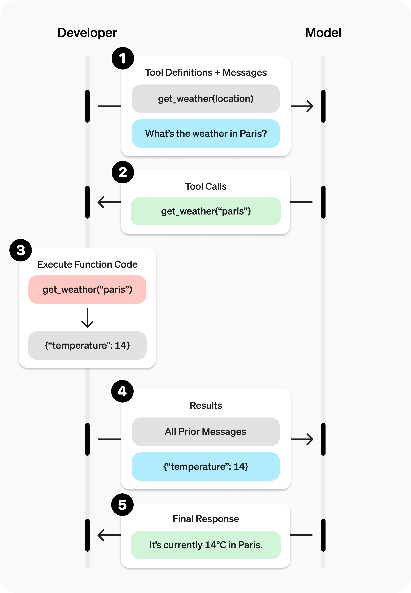

# Function Call

> Give models access to new functionality and data they can use to follow instructions and respond to prompts.
> 

> 给模型提供新的功能和数据，使它们能够更好地遵循指令并对提示作出响应。
> 

Function Call 又叫 Tool Call 给大模型提供了与外部系统交互，并访问训练数据之外的信息的方式。

**在通过实例了解工作原理之前，先从理解一些术语开始，有助于建立统一的概念。**

### Tools

Tool 或 Function 是我们告诉模型它可以使用的一种功能。当他再生成一个回答的时候，他可能会判断是否需要某个 Tool 或 Function 来获取模型外数据或者执行其他操作。例如：

1. 获取某个地点的天气
2. 查询本地的信息
3. Web 搜索

当我们向模型发送一个带有prompt的请求的时候，可以在其中包含一系列可供模型选择的工具。例如，如果我们希望模型能够回答“世界某地当前天气”的问题，可以提供一个 `get_weather`工具，并让它接收 `location` 作为参数。

### Tool calls

Tool calls 或者 Function calls，是在模型阅读完prompt之后，如果判断为了完成某个任务需要使用某个工具，会返回一个特殊的response。

如果模型收到的prompt形如：

> 巴黎的天气现在怎么样？
> 

模型可能不会直接回答这个问题，而是返回一个工具调用：

```jsx
{
	"name": "get_weather",
	"arguments": {
			"location": "Paris"
		}
}
```

表示模型想要调用`get_weather`工具，并让 `Paris`作为输入参数。

### **Tool call outputs**

Tool call outputs 或 Function call outputs，是工具根据模型发起的工具调用所生成的响应。这个输出可以是结构化的 JSON，也可以是纯文本，并且需要包含`call_id` 参数，用于将该输出与对应的工具调用进行匹配和对齐（尤其在存在多个工具调用或并发执行时）。

继续天气的例子：

- 模型拥有一个 `get_weather` 工具，该工具接收 `location` 作为参数
- 当用户问：“巴黎现在的天气如何？”时
- 模型会返回一个工具调用，其中 `location = Paris`
- 工具执行后返回结果，例如：
    
    ```
    {"temperature":"25", "unit":"C"}
    ```
    

我们随后会把以下内容一起发送回模型，工具的定义，原始的用户提示（prompt），模型发出的工具调用（tool call），工具调用的输出（tool call output）。这样，模型最终就可以生成一个文本回复，“今天巴黎的天气是 25°C”。

### The tool calling flow

Tool calling是你的应用程序与模型之间，通过API 进行的一种**多步骤对话过程**。该流程包含五个步骤：

1. 向模型发起请求，并提供它可以调用的工具
2. 从模型接收一个工具调用（tool call）
3. 在应用端根据工具调用中的输入执行代码
4. 将工具的输出作为第二次请求发送给模型
5. 从模型接收最终响应（或者更多的工具调用）



### 代码实例

```python
client = OpenAI()
```

```python
# Define a function tool for fetching weather information
get_weather_tool = {
    "type": "function",
    "name": "get_weather",
    "description": "Get today's weather for a location.",
    "parameters": {
        "type": "object",
        "properties": {
            "location": {
                "type": "string",
                "description": "A location like Paris or Singapore.",
            },
        },
        "required": ["location"],
    }
}

def get_weather(location):
    return f"The weather in {location} today is 25C."
```

定义获取天气工具

```python
tools = [get_weather_tool]
```

把天气工具装入工具集合

```python
input_list = [
    {"role": "user", "content": "Whats the weather in Paris?"}
]

# Prompt the model with tools defined
response = client.responses.create(
    model="gpt-4o-mini",
    tools=tools,
    input=input_list,
)

input_list += response.output
print(response.output)
# [ResponseFunctionToolCall(arguments='{"location":"Paris"}', call_id='call_mRMm1lLUe6EeIcEEBtC4Do1b', name='get_weather', type='function_call', id='fc_0acb6ce7f68d859f0069c5aed1ae90819694c0742c347bf56f', status='completed')]
```

大模型返回工具调用

```python
for item in response.output:
    if item.type == "function_call":
        if item.name == "get_weather":
            location = json.loads(item.arguments)["location"]
            weather = get_weather(location)
            input_list.append({
                "type": "function_call_output",
                "call_id": item.call_id,
                "output": weather,

            })
```

实现工具调用 并且把输出结果装入prompt

```python
response = client.responses.create(
    model="gpt-4o-mini",
    tools=tools,
    input=input_list,
)
print("\n" + response.output_text)
# The weather in Paris today is 25°C.
```

完成最终输出

### 用LangChain框架复现一下

官方文档

[ChatOpenAI integration - Docs by LangChain](https://docs.langchain.com/oss/python/integrations/chat/openai#using-azure-openai-v1-api-with-api-key)